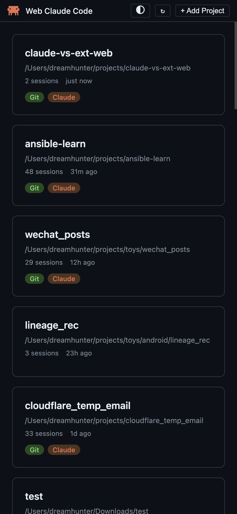
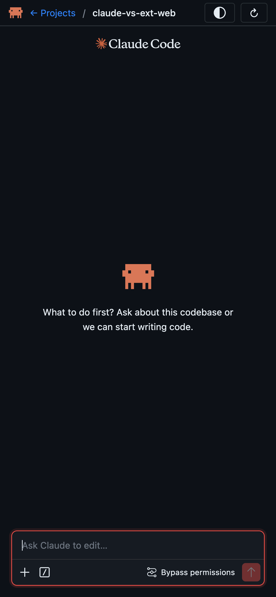
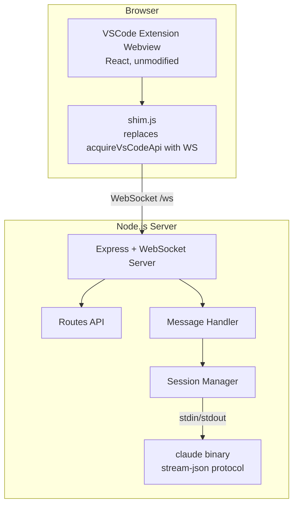

# claude-vs-ext-web — Web-Based Claude Code

[English](README.md) | [简体中文](README.zh-CN.md)

A standalone web interface for [Claude Code](https://claude.ai/code) that runs in any modern browser. claude-vs-ext-web reuses the official VSCode Claude Code extension's React chat UI through a custom shim layer, with a Node.js backend managing `claude` processes via WebSocket.

## Screenshots

<table>
  <tr>
    <td></td>
    <td></td>
  </tr>
</table>

## How It Works



**Key Insight**: Instead of rebuilding the chat UI from scratch, claude-vs-ext-web serves the extension's original webview files and injects a shim that replaces VSCode's `acquireVsCodeApi()` with a WebSocket bridge. The extension's React app works unmodified in the browser.

## Features

- **Full Claude Code Chat UI** — The same React-based interface from the VSCode extension
- **Project Discovery** — Auto-discovers projects from `~/.claude/projects/` session history
- **Session Resume** — Resume previous conversations from saved history
- **Permission Control** — Tool permission request/response flow with user approval
- **Model Selection** — Switch between Claude models (Sonnet, Opus, etc.)
- **Theme Switching** — GitHub Dark / GitHub Light themes, persisted in localStorage
- **Multi-Session** — Each project gets its own isolated `claude` process
- **Auto-Reconnect** — WebSocket reconnects automatically on disconnect (2s delay)
- **Slash Commands** — Extension slash commands work via direct input

## Prerequisites

- **Node.js** 18+ or **Bun** 1.0+
- **VSCode Claude Code Extension** — Extracted into `vendor/claude-code/`
- **Platform Support**:
  - **Windows** — Uses `claude.exe`
  - **macOS** — Uses `claude` binary
  - **Linux** — Uses `claude` binary

## Quick Start

If your `claude` binary requires environment variables (e.g., custom API endpoint), set them before starting the server. These variables will be inherited by the spawned `claude` processes.

```bash
export ANTHROPIC_BASE_URL="https://your-api-endpoint.com"
export ANTHROPIC_AUTH_TOKEN="your-token"
```

```bash
# 1. Install dependencies
bun install

# 2. Set up the vendor directory (see below)
# 3. Start the dev server
bun run dev

# 4. Open http://localhost:7860
```

## Vendor Setup

Extract the VSCode Claude Code extension into `vendor/claude-code/`:

**Option 1: From installed extension**

**Windows:**
```bash
# List available versions and copy the latest one
dir "%USERPROFILE%\.vscode\extensions\anthropic.claude-code-*"
xcopy /E /I "%USERPROFILE%\.vscode\extensions\anthropic.claude-code-<VERSION>" vendor\claude-code\
```

**macOS / Linux:**
```bash
# List available versions and copy the latest one
ls -d ~/.vscode/extensions/anthropic.claude-code-*
cp -r ~/.vscode/extensions/anthropic.claude-code-<VERSION> vendor/claude-code/
```

> Replace `<VERSION>` with the latest version directory (e.g., `2.1.86-darwin-arm64`).

**Option 2: Download VSIX directly from VSCode**

In VSCode extensions panel, right-click on Claude Code extension and select **Download Specific Version VSIX...**:


Then extract the downloaded `.vsix` file:

```bash
# Extract .vsix (it's a zip file)
unzip claude-code.vsix -d temp-extract
mv temp-extract/extension/* vendor/claude-code/
rm -rf temp-extract
```

**Option 3: From .vsix file**

```bash
# Extract .vsix (it's a zip file)
unzip claude-code.vsix -d temp-extract
mv temp-extract/extension/* vendor/claude-code/
rm -rf temp-extract
```

**Updating the vendor directory:**
```bash
# Remove old vendor and copy the new version
rm -rf vendor/claude-code
cp -r ~/.vscode/extensions/anthropic.claude-code-<VERSION> vendor/claude-code/
# Verify the version
grep '"version"' vendor/claude-code/package.json
```

Required files: `webview/`, `resources/native-binary/`, `package.json`

## Commands

| Command | Description |
|---------|-------------|
| `bun run dev` | Start with hot reload (`bun --watch`) |
| `bun run build` | Compile TypeScript to `dist/` |
| `bun run start` | Run compiled server |

## Configuration

`config.json` (auto-created if missing):

```json
{
  "port": 7860,
  "projects": {
    "roots": [],
    "manual": [],
    "scanDepth": 1
  },
  "defaults": {
    "permissionMode": "bypassPermissions",
    "model": "claude-opus-4-6[1m]"
  }
}
```

| Field | Description |
|-------|-------------|
| `port` | Server port (default: 7860) |
| `projects.roots` | Directories to scan for projects (not implemented yet) |
| `projects.manual` | Manually added project paths |
| `projects.scanDepth` | Recursion depth when scanning roots (not implemented yet) |
| `defaults.permissionMode` | `default` / `bypassPermissions` / `always-ask` |
| `defaults.model` | Default Claude model (e.g., `claude-opus-4-6[1m]`) |

<details>
<summary><b>Project Structure</b></summary>

```
src/
├── server/
│   ├── index.ts            # Express app, WebSocket, HTTP routes
│   ├── session-manager.ts  # Session lifecycle, claude process management
│   ├── message-handler.ts  # WebSocket message routing & response building
│   ├── claude-process.ts   # Spawns claude binary, parses stream-json stdout
│   ├── config.ts           # Config loading, vendor path resolution
│   └── routes.ts           # REST API (/api/projects, /api/config)
└── client/
    ├── shim.js             # WebSocket bridge replacing VSCode API
    ├── host.html           # Chat page template (server injects vars)
    ├── css-variables.css   # 239 --vscode-* CSS variables for theming
    └── project-list/       # Project selection page (vanilla JS)
```

</details>

<details>
<summary><b>Protocol Overview</b></summary>

### WebSocket Messages

**Browser → Server:**
```jsonc
{ "type": "launch_claude", "channelId": "uuid", "cwd": "/path", "model": "sonnet" }
{ "type": "io_message", "channelId": "uuid", "message": { "type": "user", ... } }
{ "type": "request", "channelId": "uuid", "requestId": "uuid", "request": { "type": "init" } }
```

**Server → Browser** (always wrapped):
```jsonc
{ "type": "from-extension", "message": { "type": "io_message", "channelId": "uuid", ... } }
```

### Claude Binary Communication

The server communicates with the `claude` binary via stdin/stdout using newline-delimited JSON (`stream-json` format). Key flows:

1. **Initialize** — Server sends `control_request{subtype:"initialize"}`, receives config (models, commands, agents)
2. **Chat** — User messages forwarded as `io_message`, responses streamed back
3. **Permissions** — `tool_permission_request` from claude → transformed → webview → user approves → `tool_permission_response` → back to claude
4. **Interrupt** — `control_request{subtype:"interrupt"}` sent to stop generation

</details>

<details>
<summary><b>Known Limitations</b></summary>

- **No SSL/TLS** — HTTP/WS only, not suitable for remote deployment without a reverse proxy
- **No file operations** — File open/diff commands are stubbed
- **No terminal integration** — Terminal commands return null
- **No MCP servers** — MCP server list returns empty stubs
- **Slash command autocomplete** — Works with direct input only, not the `/` menu dropdown

</details>

<details>
<summary><b>Troubleshooting</b></summary>

### Port already in use
```bash
# Find and kill the process on port 7860 (Windows)
netstat -ano | grep ":7860 " | grep LISTENING
taskkill //PID <pid> //F
```

### Webview crashes on load
Ensure `claudeSettings.effective.permissions` is present in the init response. The webview uses `claudeSettings?.effective.permissions` (non-optional `.permissions`), so a missing `effective` field will crash it.

### `Uncaught (in promise)` errors in console
These are normal — they come from the extension webview's internal promise handling and don't affect functionality.

</details>

## License

MIT
