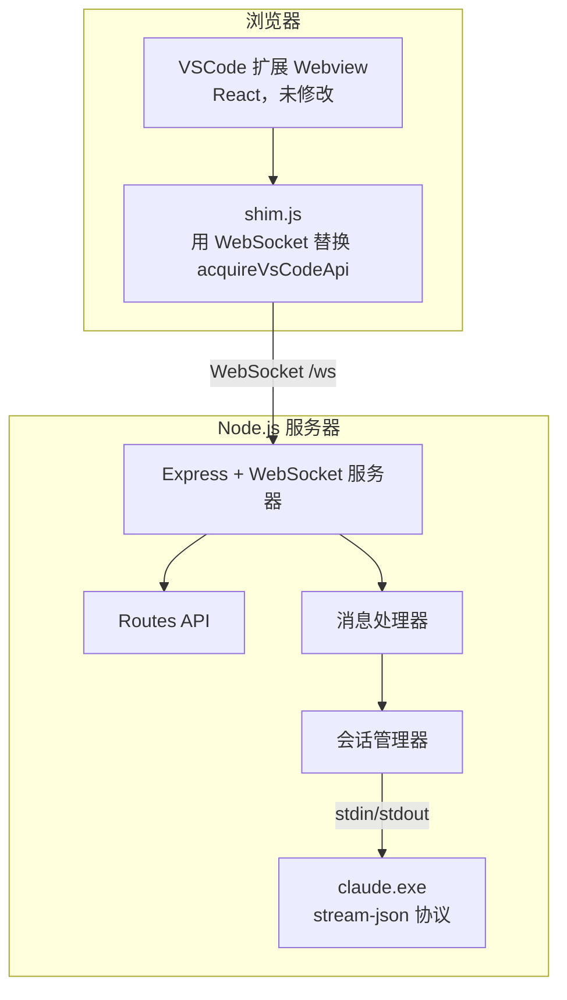

# claude-vs-ext-web — 基于 Web 的 Claude Code

[English](README.md) | [简体中文](README.zh-CN.md)

一个独立的 [Claude Code](https://claude.ai/code) Web 界面，可在任何现代浏览器中运行。claude-vs-ext-web 通过自定义 shim 层复用 VSCode Claude Code 扩展的 React 聊天 UI，并由 Node.js 后端通过 WebSocket 管理 `claude.exe` 进程。

## 截图

<table>
  <tr>
    <td></td>
    <td></td>
  </tr>
</table>

## 工作原理



**核心思路**：claude-vs-ext-web 不重新构建聊天 UI，而是直接提供扩展原始的 webview 文件，并注入一个 shim 层将 VSCode 的 `acquireVsCodeApi()` 替换为 WebSocket 桥接。扩展的 React 应用无需修改即可在浏览器中运行。

## 功能特性

- **完整的 Claude Code 聊天 UI** — 与 VSCode 扩展相同的 React 界面
- **项目发现** — 从 `~/.claude/projects/` 会话历史自动发现项目
- **会话恢复** — 从保存的历史记录恢复之前的对话
- **权限控制** — 工具权限请求/响应流程，支持用户审批
- **模型选择** — 在 Claude 模型之间切换（Sonnet、Opus 等）
- **主题切换** — GitHub Dark / GitHub Light 主题，通过 localStorage 持久化
- **多会话** — 每个项目获得独立的 `claude` 进程
- **自动重连** — WebSocket 断开后自动重连（延迟 2 秒）
- **斜杠命令** — 扩展斜杠命令可通过直接输入使用

## 前置条件

- **Node.js** 18+ 或 **Bun** 1.0+
- **VSCode Claude Code 扩展** — 解压到 `vendor/claude-code/`
- **平台支持**：
  - **Windows** — 使用 `claude.exe`
  - **macOS** — 使用 `claude` 二进制文件
  - **Linux** — 使用 `claude` 二进制文件

## 快速开始

如果你的 `claude` 二进制文件需要环境变量（例如自定义 API 端点），请在启动服务器前设置。这些变量会被生成的 `claude` 进程继承。

```bash
export ANTHROPIC_BASE_URL="https://your-api-endpoint.com"
export ANTHROPIC_AUTH_TOKEN="your-token"
```

```bash
# 1. 安装依赖
bun install

# 2. 设置 vendor 目录（见下文）
# 3. 启动开发服务器
bun run dev

# 4. 打开 http://localhost:7860
```

## Vendor 目录设置

将 VSCode Claude Code 扩展解压到 `vendor/claude-code/`：

**方式 1：从已安装的扩展**

**Windows:**
```bash
# 列出可用版本，复制最新的
dir "%USERPROFILE%\.vscode\extensions\anthropic.claude-code-*"
xcopy /E /I "%USERPROFILE%\.vscode\extensions\anthropic.claude-code-<VERSION>" vendor\claude-code\
```

**macOS / Linux:**
```bash
# 列出可用版本，复制最新的
ls -d ~/.vscode/extensions/anthropic.claude-code-*
cp -r ~/.vscode/extensions/anthropic.claude-code-<VERSION> vendor/claude-code/
```

> 将 `<VERSION>` 替换为最新版本目录名（如 `2.1.86-darwin-arm64`）。

**方式 2：从 .vsix 文件**

```bash
# 解压 .vsix（本质是 zip 文件）
unzip claude-code.vsix -d temp-extract
mv temp-extract/extension/* vendor/claude-code/
rm -rf temp-extract
```

**更新 vendor 目录：**
```bash
# 删除旧版本并复制新版本
rm -rf vendor/claude-code
cp -r ~/.vscode/extensions/anthropic.claude-code-<VERSION> vendor/claude-code/
# 验证版本
grep '"version"' vendor/claude-code/package.json
```

必需文件：`webview/`、`resources/native-binary/`、`package.json`

## 命令

| 命令 | 说明 |
|------|------|
| `bun run dev` | 热重载启动（`bun --watch`） |
| `bun run build` | 编译 TypeScript 到 `dist/` |
| `bun run start` | 运行编译后的服务器 |

## 配置

`config.json`（缺失时自动创建）：

```json
{
  "port": 7860,
  "projects": {
    "roots": [],
    "manual": [],
    "scanDepth": 1
  },
  "defaults": {
    "permissionMode": "bypassPermissions",
    "model": "claude-opus-4-6[1m]"
  }
}
```

| 字段 | 说明 |
|------|------|
| `port` | 服务器端口（默认：7860） |
| `projects.roots` | 要扫描项目的目录列表（暂未实现） |
| `projects.manual` | 手动添加的项目路径 |
| `projects.scanDepth` | 扫描根目录时的递归深度（暂未实现） |
| `defaults.permissionMode` | `default` / `bypassPermissions` / `always-ask` |
| `defaults.model` | 默认 Claude 模型（如 `claude-opus-4-6[1m]`） |

<details>
<summary><b>项目结构</b></summary>

```
src/
├── server/
│   ├── index.ts            # Express 应用、WebSocket、HTTP 路由
│   ├── session-manager.ts  # 会话生命周期、claude.exe 进程管理
│   ├── message-handler.ts  # WebSocket 消息路由与响应构建
│   ├── claude-process.ts   # 启动 claude.exe，解析 stream-json 输出
│   ├── config.ts           # 配置加载、vendor 路径解析
│   └── routes.ts           # REST API（/api/projects, /api/config）
└── client/
    ├── shim.js             # WebSocket 桥接，替换 VSCode API
    ├── host.html           # 聊天页面模板（服务器注入变量）
    ├── css-variables.css   # 239 个 --vscode-* CSS 变量用于主题
    └── project-list/       # 项目选择页面（原生 JS）
```

</details>

<details>
<summary><b>协议概览</b></summary>

### WebSocket 消息

**浏览器 → 服务器：**
```jsonc
{ "type": "launch_claude", "channelId": "uuid", "cwd": "/path", "model": "sonnet" }
{ "type": "io_message", "channelId": "uuid", "message": { "type": "user", ... } }
{ "type": "request", "channelId": "uuid", "requestId": "uuid", "request": { "type": "init" } }
```

**服务器 → 浏览器**（始终包装）：
```jsonc
{ "type": "from-extension", "message": { "type": "io_message", "channelId": "uuid", ... } }
```

### claude.exe 通信

服务器通过 stdin/stdout 使用换行分隔的 JSON（`stream-json` 格式）与 `claude.exe` 通信。关键流程：

1. **初始化** — 服务器发送 `control_request{subtype:"initialize"}`，接收配置（模型、命令、代理）
2. **聊天** — 用户消息以 `io_message` 转发，响应流式返回
3. **权限** — `tool_permission_request` 从 claude.exe → 转换格式 → 发送到 webview → 用户审批 → `tool_permission_response` → 返回 claude.exe
4. **中断** — 发送 `control_request{subtype:"interrupt"}` 停止生成

</details>

<details>
<summary><b>已知限制</b></summary>

- **无 SSL/TLS** — 仅支持 HTTP/WS，不适合无反向代理的远程部署
- **无文件操作** — 文件打开/差异对比命令为存根
- **无终端集成** — 终端命令返回 null
- **无 MCP 服务器** — MCP 服务器列表返回空存根
- **斜杠命令自动补全** — 仅支持直接输入，不支持 `/` 菜单下拉

</details>

<details>
<summary><b>故障排除</b></summary>

### 端口被占用
```bash
# 查找并杀死占用 7860 端口的进程（Windows）
netstat -ano | grep ":7860 " | grep LISTENING
taskkill //PID <pid> //F
```

### Webview 加载时崩溃
确保 init 响应中包含 `claudeSettings.effective.permissions`。Webview 使用 `claudeSettings?.effective.permissions`（`.permissions` 非可选），缺少 `effective` 字段会导致崩溃。

### 控制台出现 `Uncaught (in promise)` 错误
这是正常现象，来自扩展 webview 内部的 Promise 处理，不影响功能。

</details>

## 许可证

MIT
